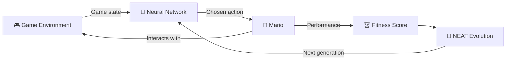

<div align="center">

# 🍄Mario on Coke🤖

### Teaching a Neural Network to play Super Mario using Neuroevolution

*Sometimes the best way to learn AI is to let Mario repeatedly run into a Ditch until he figures it out that he should'nt.*


</div>

---

## 📖 Table of Contents

- [Overview](#-overview)
- [Why This Project?](#-why-this-project)
- [Tech Stack](#-tech-stack)
- [How It Works](#-how-it-works)
- [Installation](#-installation)
- [Running the Project](#-running-the-project)
- [Project Status](#-project-status)
- [Learning Goals](#-learning-goals)
- [Troubleshooting](#-troubleshooting)
- [Contributing](#-contributing)
- [Disclaimer](#-disclaimer)
- [Author](#-author)
- [License](#-license)

---

## 🎮 Overview

**Mario on Coke** is a fun learning project where I experiment with **Machine Learning**, **Neural Networks**, and **Neuroevolution** to teach an AI agent how to play *Super Mario Bros.*

The goal isn't to solve a real-world problem(I mean yeah what could this NN do save the world or Get me Bitches????). It's to explore how intelligent agents can learn through trial and error , evolve over generations , and gradually improve their gameplay performance. OR In other LAME TERMS **Computer can Also Fuck Around and Find Out**.

---

## 💡 Why This Project?

I saw an 11 Year Old video where a Creator called SethBlink Did this in Lua language and Since i have this Burning Curiosity on HOW TO DO IT, I thought why not give it a try. I learned many things During this path.

-  Neural Networks
-  Neuroevolution
-  Reinforcement Learning concepts
-  AI agents and game environments
-  Training and evaluating machine learning models(Which is fuckin bad)
-  Python libraries used in AI research

And frankly Speaking, teaching Mario to play Mario sounded fun about 10% of the Time, The Rest 90% was Hell👍.

---

## 🛠️ Tech Stack

**Language:** Python

| Library | Purpose |
|---|---|
| `gym-super-mario-bros` | Super Mario game environment |
| `nes-py` | NES emulator interface |
| `gymnasium` | Reinforcement learning environment framework |
| `neat-python` | Neuroevolution of Augmenting Topologies (NEAT) |
| `numpy` | Numerical computations |
| `opencv-python` | Image processing and frame manipulation |
| `matplotlib` | Data visualization and plotting |
| `graphviz` | Visualizing neural network structures |

---

## ⚙️ How It Works



1. The **game environment** provides Mario's current state.
2. A **Neural Network** receives information from the environment.
3. The network **decides which action** to perform.
4. Mario **interacts with the game world**.
5. The agent receives a **fitness score** based on performance.
6. **NEAT evolves** better neural networks over multiple generations.
7. Over time, the AI learns to **survive longer and play more effectively**.

---

## 🚀 Installation

### 1. Clone the repository

```bash
git clone https://github.com/your-username/mario-on-coke.git
cd mario-on-coke
```

### 2. Create a virtual environment

```bash
python -m venv venv
```

### 3. Activate it

**Windows**
```bash
venv\Scripts\activate
```

**Linux / macOS**
```bash
source venv/bin/activate
```

### 4. Install dependencies

**Option A: using `requirements.txt`**
```bash
pip install -r requirements.txt
```

**Option B: install manually**
```bash
pip install gym-super-mario-bros
pip install nes-py
pip install gymnasium
pip install neat-python
pip install numpy
pip install opencv-python
pip install matplotlib
pip install graphviz
```

> 💡 **Note:** The `graphviz` Python package also needs the [Graphviz system binaries](https://graphviz.org/download/) installed to render network diagrams.

---

## ▶️ Running the Project

```bash
python main.py
```

> The exact execution process may change as the project evolves.

---

## 🚧 Project Status

**Work in Progress.** This project is actively being built and explored. Expect:

- 🔄 Frequent changes
- 🧪 Experimental features
- 🧹 Refactoring
- 🆕 New training approaches
- 📚 Lots of learning

---

## 🎯 Learning Goals

- Understand how Neural Networks make decisions
- Learn the fundamentals of NEAT
- Explore game AI development
- Experiment with evolutionary algorithms
- Improve Python and Machine Learning skills

---

## 🩺 Troubleshooting That Occured In Development

<details>
<summary><b>Installation of <code>nes-py</code> fails</b></summary>

`nes-py` compiles C++ extensions. Make sure you have a C++ compiler installed:
- **Windows:** Microsoft C++ Build Tools
- **Linux:** `sudo apt install build-essential`
- **macOS:** `xcode-select --install`

</details>

<details>
<summary><b>Version conflicts between <code>gym</code>, <code>gymnasium</code>, and <code>numpy</code></b></summary>

`gym-super-mario-bros` and `nes-py` were built around the older `gym` API and can be sensitive to newer `numpy` versions. If you hit errors, try pinning older versions of `numpy` or using a compatibility wrapper, and check each library's issue tracker for the latest fixes.

</details>

<details>
<summary><b>Graphviz diagrams don't render</b></summary>

Install the Graphviz system package (not just the Python wrapper) and make sure it's on your `PATH`.

</details>

---

## ⚠️ Disclaimer

This project is primarily a **personal learning project**. The codebase may change So best of Luck Unnderstanding It.
*Super Mario Bros.*👍👍

---

## 👤 Author

**Abhishek Sharma**

---

## 📄 License

    👍

---

<div align="center">

⭐ If you enjoyed watching Mario learn, consider giving the repo a star! ⭐

</div>
